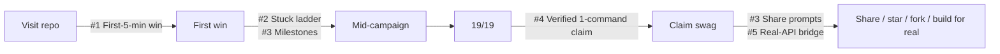

# PLANv2: Growth, Retention and Completion Plan

This plan covers the player and community experience only. It does not assess code quality.

**Goals:** increase completion rate, retention, learning outcomes, community engagement, swag claim completion, and GitHub stars/forks.

**Legend:** Effort S = up to 4h, M = 4 to 12h, L = more than 12h. Priority P1 = do now, P2 = next release, P3 = later.

---

## 0. Snapshot: what the repo shows today

> This snapshot was taken before v2.0.0 (19 levels, v1.7.0). The crossed-out items below have since shipped in v2.0.0. See [CHANGELOG.md](CHANGELOG.md).

| Signal | Observation | Source |
|---|---|---|
| Public completions | 5 swag claims. Reported times range from 2h to about 30h. | [README.md](README.md) leaderboard |
| Campaign size | 19 levels, and swag requires all 19. There is no reward in between. | [README.md](README.md), [certificate.ts](packages/cli/src/services/certificate.ts) |
| First level | S1L1 is labelled `beginner`. It needs three fixes (credential source, cursor pagination, balance aggregation), and it depends on the mock API starting. | [story.md](seasons/season-1/level-1/story.md), [manifest.json](seasons/season-1/level-1/manifest.json) |
| Easiest no-API level | S2L1 `Merchant Mirage` is `beginner` with `apiRequired: false`. | [manifest.json](seasons/season-2/level-1/manifest.json) |
| Post-win routing | The "Next level" prompt follows season/level order (S1L1 → S1L2 `intermediate`). It ignores the recommended Quickstart Path (S1L1 → S2L1 → S4L1). | `getNextLevelCommand()` in [test.ts](packages/cli/src/commands/test.ts) |
| Hints | Each level has exactly 2 hints. After both are used, the player sees "You've already unlocked all 2 hint(s)" and nothing else. | [hint.ts](packages/cli/src/commands/hint.ts) |
| XP | The no-hint bonus is all-or-nothing: 1 hint costs the same as 2. Titles are only awarded at 19/19. Before that every player is a "Response Cell Recruit". | `calculateLevelXp()` and `playerTitle()` in [certificate.ts](packages/cli/src/services/certificate.ts) |
| Swag claim | The claim needs a manual screenshot and a self-reported HH:MM:SS time. A maintainer then sends a form link by hand. `startedAt` and `completedAt` are already recorded, but the claim doesn't use them. | [swag_claim.yml](.github/ISSUE_TEMPLATE/swag_claim.yml), [schemas.ts](packages/shared/src/schemas.ts) |
| Anti-cheat | `reference/solution.js` is committed for every level, and player `solution.js` is gitignored. Nothing ties a claim to a real solve. | [.gitignore](.gitignore) |
| Leaderboard | Maintained by hand in the README. The facilitator guide suggests "a shared spreadsheet" for workshops. | [README.md](README.md), [facilitator-guide.md](docs/facilitator-guide.md) |
| Social surfaces | No share, star, or Discussions prompt anywhere in the CLI. Discussions are only linked from the issue template config. | [config.yml](.github/ISSUE_TEMPLATE/config.yml) |
| Real-world bridge | No level, debrief, or CLI output links to the real Investec developer portal or Programmable Banking sandbox. | grep across `seasons/**` and `packages/cli/src/**` |
| Content balance | Season 3 has 1 level. Seasons 1, 2 and 4 have 6 each. | `seasons/season-3/` |
| Zero-install path | No `.devcontainer` or Codespaces config. Players need Node 20 and pnpm 9 locally, and Windows users get a separate setup doc. | repo root, [windows-setup.md](docs/windows-setup.md) |
| Default entry | Running `pnpm game` with no arguments prints commander help. There is no guided "start" flow. | [index.ts](packages/cli/src/index.ts) |
| Demo media | There is a guide for recording a GIF, but no GIF is in the README. | [terminal-demo-gif.md](docs/terminal-demo-gif.md) |

---

## 1. First-hour experience

### ~~R1. Make the first win happen in under 5 minutes~~ (Done)
- **Status:** Shipped. The Quickstart Path is now S2L1 → S1L1 → S4L1. The S1L1 and S2L1 briefs were rewritten to read naturally in either order, and carry-forward output shows `not assessed yet` instead of consequences for missions not yet played. The optional Level 0 tutorial was not built.
- **Problem:** The first mission is the heaviest "beginner" level, and it's the only one on the Quickstart Path that needs the mock API. The first 10 minutes are where most players quit.
- **Evidence:** S1L1 needs 3 separate fixes plus a spawned API process. S2L1 is beginner, runs offline, and fixes one bug (MCC normalisation). The README Quickstart starts at S1L1.
- **Expected impact:** Higher rate of players reaching one completed level, which is the strongest predictor of finishing. Fewer setup-related quits because the first run needs no API.
- **Effort:** S
- **Priority:** P1
- **Plan:** Reorder the Quickstart Path to S2L1 → S1L1 → S4L1. Update the README and facilitator guide to match. Optionally add a 2-minute "Level 0 / Tutorial" that has a single failing assertion and a single attack.

### ~~R2. Add `pnpm game start` as the default command~~ (Done)
- **Status:** Shipped. Bare `pnpm game` runs `start`, which briefs new players and loads the induction mission, or resumes and continues for returning players.
- **Problem:** Players have to remember `level <n> --season <n>` syntax. With no arguments, `pnpm game` shows raw help.
- **Evidence:** No default action is registered in [index.ts](packages/cli/src/index.ts).
- **Expected impact:** Less friction at the start and when returning after a break. Returning players land on their next mission straight away.
- **Effort:** S
- **Priority:** P1
- **Plan:** With no arguments on a fresh profile, run preflight, show a 3-line pitch, load the first Quickstart level, and print "edit X, then run `pnpm game test`". On an existing profile, show "Continue: <next level on active path>" plus progress.

### ~~R3. Route "Next level" through the player's active path~~ (Done)
- **Status:** Shipped. `resolveNextMission()` routes through the Quickstart Path, then the Grandmaster Run. It is used by the win banner, `start`, `status`, and `certificate`.
- **Problem:** After the first win, players get sent to S1L2 `Token Trouble` (intermediate, API). The docs promise S2L1. This causes a difficulty spike right after the first success.
- **Evidence:** `getNextLevelCommand()` sorts by season and level only. `summarizePathProgress()` already computes path-aware next levels.
- **Expected impact:** Smoother difficulty curve and fewer quits at level 2.
- **Effort:** S
- **Priority:** P1

### ~~R4. Add a Codespaces / devcontainer one-click path~~ (Done)
- **Status:** Shipped. `.devcontainer/devcontainer.json` is added, with the Codespaces badge and instructions in the README, facilitator guide, and Windows setup.
- **Problem:** Local Node and pnpm setup, plus the Windows PowerShell policy, block a share of players before they play.
- **Evidence:** No `.devcontainer/`. A separate Windows setup doc exists. The troubleshooting doc covers install failures.
- **Expected impact:** More players get from visiting the repo to playing. Workshops start faster. The "Open in Codespaces" badge also works as a README CTA.
- **Effort:** S
- **Priority:** P2

### R5. Add a README hero GIF and "what you'll learn in 10 minutes"
- **Problem:** The README is a long reference document. Its above-the-fold section doesn't sell the loop (break → test → Red Team blocked).
- **Evidence:** The GIF guide exists but no GIF is embedded. The screenshot is static.
- **Expected impact:** More visitors become players and more star the repo.
- **Effort:** S
- **Priority:** P2

---

## 2. Quit moments

### ~~R6. Stuck-escape ladder after hints run out~~ (Done)
- **Status:** Shipped. Once the hints are used up, the ladder offers `explain`, then `hint --walkthrough` (generated from the first failing assertion, costs a hint the first time), then a pre-filled Discussions link (`category=q-a`). `test` shows it automatically after 5 attempts.
- **Problem:** When both hints are used, the game has no next step. This is the most likely rage-quit point on intermediate and advanced levels.
- **Evidence:** [hint.ts](packages/cli/src/commands/hint.ts) prints "already unlocked all hints". `explain` exists but isn't suggested at this point.
- **Expected impact:** Fewer quits on levels 3–6 of each season. More Discussions activity.
- **Effort:** S
- **Priority:** P1
- **Plan:**
  1. After hint 2, automatically suggest `pnpm game explain`.
  2. Add an optional hint 3, a "walkthrough" that points to the exact failing assertion and its intent. It costs XP.
  3. Print a pre-filled GitHub Discussions link, for example `?category=help&title=[S1L3] stuck on ...`.
  4. After N attempts without a pass, proactively offer the ladder.

### ~~R7. Show progress inside a failing level~~ (Done)
- **Status:** Shipped. Last-run pass counts are stored per level, and failing `test`/`watch` runs show a behavior and Red Team delta with a verdict line.
- **Problem:** A red run doesn't show whether the player is getting closer.
- **Evidence:** Feedback shows pass/fail per test, but there's no comparison with the previous run.
- **Expected impact:** More persistence on hard levels, because partial progress becomes visible.
- **Effort:** S
- **Priority:** P2
- **Plan:** Store the last-run pass count and show "Behavior 3/5 → 4/5 ▲" with a short encouraging line.

### ~~R8. Show time and difficulty expectations per level~~ (Done)
- **Status:** Shipped. `estimatedMinutes` is set on all 19 manifests and the template, required by the validator, and supported by `create-level --minutes`. It's shown in `level`, `status`, and `map`.
- **Problem:** Players can't plan sessions. The 2h–30h spread suggests some hit walls they didn't expect.
- **Evidence:** The manifest has `difficulty` but no time estimate. The swag claim asks for time after the fact.
- **Expected impact:** Better session planning and fewer mid-level abandons. Workshop timing gets easier too.
- **Effort:** S
- **Priority:** P3
- **Plan:** Add an `estimatedMinutes` field to the manifest and show it in `map`, `level`, and `status`.

---

## 3. Reward loops

### ~~R9. Milestone rewards before 19/19~~ (Done)
- **Status:** Shipped. Path and season badges are announced on the win banner, alongside a rank ladder (Recruit/Analyst/Responder/Specialist) and `pnpm game badge` with share text. The one-time star/share prompts (R12) are not included.
- **Problem:** The only reward is at the end of a campaign that takes 2–30 hours. Nothing celebrates finishing a path or a season.
- **Evidence:** `playerTitle()` returns "Response Cell Recruit" for every state below 19/19. `certificate` is locked until everything is complete. The status output shows only a plain "complete" label per season.
- **Expected impact:** Better retention through the middle of the campaign. Each milestone becomes a reason to share.
- **Effort:** M
- **Priority:** P1
- **Plan:**
  - Path and season completion banners: Quickstart Graduate, API Foundations, Card Code Operator, Security Specialist, AI Guardian.
  - Titles that grow with progress, for example 3 levels = Analyst, 6 = Responder, 12 = Specialist, 19 = Grandmaster, with the existing XP-quality titles on top.
  - `pnpm game badge` prints mini-certificates per path, with share copy.

### ~~R10. Graduated XP instead of binary penalties~~ (Done)
- **Status:** Shipped. Hint bonus is 50/25/10/0 and attempt bonus is 25/10/0. The win banner shows the breakdown, and hint unlocks show the new bonus. Max XP is unchanged; existing profiles are re-scored.
- **Problem:** Using 1 hint removes the whole no-hint bonus. Once a player has used a hint, there's no reason to hold back on the second, or to try for a cleaner solve.
- **Evidence:** `calculateLevelXp()` gives +50 only when `hintsUsed === 0` and +25 only when `attempts <= 2`.
- **Expected impact:** Hints and attempts become real trade-offs, and replaying for XP becomes worthwhile.
- **Effort:** S
- **Priority:** P2
- **Plan:** Scale the bonuses (for example 50/25/10/0 by hints used). The release invariant "XP behaviour unchanged" needs to be explicitly lifted for this.

### ~~R11. Streaks and "come back" hooks~~ (Done)
- **Status:** Shipped. A local daily streak (best streak too) is updated on each evaluation. `pnpm game` shows a welcome-back panel with when you last played, your streak, and the nearest badge. `status` shows the streak. No telemetry.
- **Problem:** Nothing brings a player back the next day.
- **Evidence:** Progress has timestamps but no concept of a session or streak.
- **Expected impact:** More day-2 and day-7 returns.
- **Effort:** S
- **Priority:** P3
- **Plan:** Show "Last played 3 days ago, 2 levels to finish Card Code" on start. Add a local daily streak counter. No telemetry.

---

## 4. Social mechanics

### ~~R12. Share and star prompts at moments of delight~~ (Done, v2.0.0)
- **Status:** Shipped. One share prompt per moment (first win, first boss, path complete, campaign complete) with GitHub star, X, and LinkedIn links and share text. Each appears once per profile. Opt out with `GAME_QUIET_SOCIAL=1` or `--quiet-social`.
- **Problem:** The CLI has good emotional peaks (Red Team blocked, boss beaten, campaign complete) and turns none of them into sharing or starring.
- **Evidence:** No share, star, or Discussions strings in `packages/cli/src/**`.
- **Expected impact:** More GitHub stars and organic reach on LinkedIn and X. This is the cheapest lever for stars.
- **Effort:** S
- **Priority:** P1
- **Plan:** Show each prompt once per milestone (first win, first boss, path complete, 19/19), and never repeat it. Include a pre-written share URL with `#InvestecDevQuest`, a repo star link, and a respectful "if this helped, star the repo" line. Add a `--quiet-social` option or an env flag to turn prompts off.

### R13. Team and workshop mode
- **Problem:** Facilitators fall back on screenshots and spreadsheets to run a room leaderboard.
- **Evidence:** [facilitator-guide.md](docs/facilitator-guide.md) says: "Leaderboard via `pnpm game status` screenshots or a shared spreadsheet".
- **Expected impact:** Better workshop energy and more events run. Events are the main acquisition channel for a DevRel game.
- **Effort:** M
- **Priority:** P2
- **Plan:** `pnpm game status --export` prints a compact JSON or line format. A facilitator script combines pasted exports into a ranked table. A hosted service is optional later.

### ~~R14. Pair / "compare with a friend" prompt after reference~~ (Done, v2.0.0)
- **Status:** Shipped. `reference` ends with the five debrief questions and a pre-filled Discussions **Show and tell** link titled `[SxLy] My approach: <level>`.
- **Problem:** Reference review is a solo activity, even though most of the learning comes from comparing approaches.
- **Evidence:** The facilitator debrief prompts exist only in the docs, not in the CLI.
- **Expected impact:** Deeper learning and more Discussions threads.
- **Effort:** S
- **Priority:** P3
- **Plan:** Show the 5 debrief questions after `reference`. Link to a per-level Discussions thread titled "Share your approach".

---

## 5. Progression

### ~~R15. Balance Season 3~~ (Done, v2.0.0)
- **Status:** Shipped. Four new missions: `s3-l2` Replay Rewind, `s3-l3` Callback Trap, `s3-l4` Ledger Lock, and `s3-l5` Season Boss: Settlement Sentinel. The campaign is now 23 levels, and all pass strict validation.
- **Problem:** Season 3 (Secure Fintech Workflows) has 1 level, while the others have 6. It reads as unfinished and breaks the season rhythm.
- **Evidence:** `seasons/season-3/` contains only `level-1`.
- **Expected impact:** A more coherent progression. The security path gets stronger, and there's a natural "call for community levels".
- **Effort:** L
- **Priority:** P2
- **Plan:** Add replay protection, SSRF-safe callback URLs, tamper-evident audit logs, and a boss level. Level ideas already exist in the security track of the facilitator guide.

### R16. A visible skill tree in `map`
- **Problem:** `map` lists paths, but players can't see how skills build on each other or where carry-forward consequences come from.
- **Evidence:** Arc flags link S1L3 logging to Season 2+ visibility, but this only shows up after the fact in `reference`.
- **Expected impact:** A stronger sense of mastery and more motivation to "fix it properly".
- **Effort:** M
- **Priority:** P3

---

## 6. Community mechanics

### R17. Verified, low-friction swag claim with an auto-leaderboard
- **Problem:** Claiming is manual on both sides: screenshot, self-reported time, maintainer DM. There's no verification, and the reference solutions are public.
- **Evidence:** [swag_claim.yml](.github/ISSUE_TEMPLATE/swag_claim.yml). The README leaderboard is hand-edited. `reference/solution.js` is committed and `seasons/**/solution.js` is gitignored.
- **Expected impact:** More completers actually claim, since the drop-off between finishing and claiming is real. Maintainers spend less time per claim. Verified entries earn more trust. Every claimant forks the repo.
- **Effort:** M
- **Priority:** P1
- **Plan:**
  1. `pnpm game claim` generates a claim bundle: level list, per-level attempts and hints, total time computed from `startedAt`/`completedAt`, XP, CLI version, and a content hash.
  2. The claim opens a pre-filled issue URL, so no screenshot is needed.
  3. Optional stronger proof: copy the solutions into `claims/<handle>/` on the player's fork. A GitHub Action runs the behavior and attack suites against them and flags byte-identical copies of the reference for manual review.
  4. When a maintainer applies the `verified` label, an Action appends the player to the leaderboard. Consider moving the leaderboard to `LEADERBOARD.md` so the README stays stable.

### R18. Credit level authors and seed good first issues
- **Problem:** Contributor tooling exists (`create-level`, level proposal template), but contributors get no visible reward and have no clear starting point.
- **Evidence:** The manifest has no `author` field. No good-first-issue labelled level ideas are referenced.
- **Expected impact:** More contributed levels, forks, and PRs, which means more content without core-team cost.
- **Effort:** S
- **Priority:** P2
- **Plan:** Add an `author` field to the manifest and show "Level by @handle" in the level brief and debrief. Open 5–10 labelled issues from the Season 3 and 4 idea list. Add a Contributors section to the README.

### R19. Community Season / monthly Red Team challenge
- **Problem:** Once a player finishes, there's nothing new to bring them back or to talk about publicly.
- **Evidence:** The content is static. The [CHANGELOG.md](CHANGELOG.md) shows releases are feature-driven, not event-driven.
- **Expected impact:** Returning players and a regular calendar of posts, which keeps the stars trend growing.
- **Effort:** M (process) to L (content)
- **Priority:** P3
- **Plan:** Once a month, release one community-authored level as a limited-time challenge, announced in Discussions with a separate mini-leaderboard.

---

## 7. Replayability

### R20. Hard Mode / Red Team+ using the existing mutation checks
- **Problem:** Finished players have no reason to replay, except manually resetting to chase XP.
- **Evidence:** Curated mutation and valid-alternative checks already exist for some levels (Unreleased section of [CHANGELOG.md](CHANGELOG.md)). `reset --yes` wipes everything.
- **Expected impact:** Replay by strong players, which produces more content for leaderboards and sharing.
- **Effort:** M
- **Priority:** P2
- **Plan:** `pnpm game test --hard` adds extra attack variants and removes hints. Per-level `reset` keeps the best XP. Hard Mode completions get their own badge and title.

### R21. Speedrun timer from existing timestamps
- **Problem:** The leaderboard ranks by self-reported time, while exact timestamps sit unused.
- **Evidence:** `LevelProgress.startedAt` and `completedAt` in [schemas.ts](packages/shared/src/schemas.ts).
- **Expected impact:** A fair and fun competitive layer that feeds R17.
- **Effort:** S
- **Priority:** P2

---

## 8. Learning outcomes

### ~~R22. "Graduate to the real API" bridge~~ (Done, v2.0.0)
- **Status:** Shipped. Every debrief has a validator-enforced `Try it for real` section linking verified Investec developer portal pages, sandbox, card IDE guide, and community resources. A "What to build next" panel appears on path completion and on the certificate.
- **Problem:** The game teaches Investec patterns but never points players to real Investec developer resources. That's the key DevRel conversion.
- **Evidence:** There are zero links to the Investec developer portal or sandbox in `seasons/**` or the CLI. API specs are in `docs/*.json` but aren't surfaced to players.
- **Expected impact:** Learning carries into real integrations, and the program gets a measurable DevRel funnel.
- **Effort:** S
- **Priority:** P1
- **Plan:** Add a "Try it for real" block to each debrief (relevant endpoint doc and sandbox link). Add a closing "What to build next" panel on campaign complete and path complete.

### R23. Reflection checkpoint before unlocking the reference
- **Problem:** Players can pass the tests and move on without putting the principle into words, which weakens retention of the lesson.
- **Evidence:** The facilitator debrief prompts exist only in the docs.
- **Expected impact:** Better learning retention and higher-quality Discussions posts when players share their answers.
- **Effort:** S
- **Priority:** P3
- **Plan:** After a win, ask one optional "In one sentence, what did the attack exploit?" and store the answer in the case file. The journal then becomes a personal study log.

---

## 9. Prioritised backlog summary

| # | Recommendation | Goal(s) | Effort | Priority |
|---|---|---|---|---|
| ~~R1~~ | ~~First win in <5 min (reorder Quickstart / tutorial)~~ Done | Completion, retention | S | P1 |
| ~~R2~~ | ~~`pnpm game start` default command~~ Done | Completion, retention | S | P1 |
| ~~R3~~ | ~~Path-aware "Next level"~~ Done | Completion | S | P1 |
| ~~R6~~ | ~~Stuck-escape ladder~~ Done | Completion, community | S | P1 |
| ~~R9~~ | ~~Milestone rewards and growing titles~~ Done | Retention, sharing | M | P1 |
| ~~R12~~ | ~~Share/star prompts at peaks~~ Done | Stars, community | S | P1 |
| R17 | Verified claim and auto-leaderboard | Swag claims, forks | M | P1 |
| ~~R22~~ | ~~Graduate to the real API~~ Done | Learning, DevRel funnel | S | P1 |
| ~~R4~~ | ~~Codespaces devcontainer~~ Done | Completion | S | P2 |
| R5 | README hero GIF | Stars | S | P2 |
| ~~R7~~ | ~~Progress delta on failing runs~~ Done | Retention | S | P2 |
| ~~R10~~ | ~~Graduated XP~~ Done | Replayability | S | P2 |
| R13 | Workshop/team mode | Community | M | P2 |
| ~~R15~~ | ~~Season 3 expansion~~ Done | Progression | L | P2 |
| R18 | Author credits and good first issues | Community, forks | S | P2 |
| R20 | Hard Mode / Red Team+ | Replayability | M | P2 |
| R21 | Speedrun timer | Replayability, swag | S | P2 |
| ~~R8~~ | ~~Time estimates per level~~ Done | Completion | S | P3 |
| ~~R11~~ | ~~Streaks / come-back hooks~~ Done | Retention | S | P3 |
| ~~R14~~ | ~~Compare-with-a-friend prompt~~ Done | Learning, community | S | P3 |
| R16 | Skill tree in `map` | Progression | M | P3 |
| R19 | Monthly community challenge | Community, retention | M–L | P3 |
| R23 | Reflection checkpoint | Learning | S | P3 |

---

## 10. If I had 20 hours and only 5 improvements

The funnel today looks like this: **visit → first win → mid-campaign → finish → claim → share**. Each of the five items below targets the biggest leak at one stage. Together they cover every goal.

### ~~1. First win in 5 minutes: `start` command, Quickstart reorder, path-aware next (R1 + R2 + R3): **4h**~~ (Done)
- **What:** `pnpm game` with no arguments now starts or continues play. The Quickstart becomes S2L1 → S1L1 → S4L1. The win banner points to the next level on the active path.
- **Why:** Completion depends most on getting the first win. The current first level is the hardest "beginner" level and the only Quickstart level that needs the API. After a win, players are sent into a difficulty spike. All three fixes are small edits to existing code (`paths.ts`, `test.ts`, `index.ts`, README).

### ~~2. Stuck-escape ladder (R6): **3h**~~ (Done)
- **What:** After hint 2, suggest `explain` automatically, add an XP-costed hint 3 (walkthrough), and print a pre-filled Discussions link. After several failed attempts, offer the ladder without being asked.
- **Why:** Every 30h completer got stuck somewhere, and today that moment ends with nothing to do. This removes the most likely quit point and sends stuck players to Discussions, which makes the community visible and gives new players searchable answers.

### ~~3. Milestone rewards and share/star moments (R9 + R12): **5h**~~ (Done)
- **What:** Path and season completion banners, titles that grow at 3/6/12/19 levels, and a one-time share and star prompt at first win, first boss, path complete, and 19/19.
- **Why:** The only reward sits 2–30 hours away. Milestones break the campaign into goals a player can finish in one evening. Each milestone is also the right moment to ask for a star or a post. This is the cheapest lever for GitHub stars and word-of-mouth.

### 4. Verified one-command swag claim and auto-leaderboard (R17 + R21): **6h**
- **What:** `pnpm game claim` computes the real time from timestamps, builds a claim bundle, and opens a pre-filled issue URL. An optional fork-based GitHub Action runs the suites against the player's `claims/<handle>/` folder and flags exact reference copies. A `verified` label appends the player to the leaderboard automatically.
- **Why:** The step between finishing and claiming is pure admin (screenshots, manual time, maintainer DMs), and every piece of friction there loses a completer who would share. Verification protects the value of the swag and the leaderboard. The fork-based proof also increases forks, one of the target metrics.

### ~~5. "Graduate to the real Investec API" bridge (R22): **2h**~~ (Done)
- **What:** A "Try it for real" block in every debrief (relevant endpoint doc and sandbox link), plus a "What to build next" panel on path and campaign completion.
- **Why:** This turns the game from a closed loop into a funnel into the Investec developer community, the reason the project exists. It's mostly content work and supports learning outcomes directly.

**Total: 20h.** Suggested order: #1, #2, #5, #3, #4. This ships the retention fixes first, then the reward and social layer, then the claim pipeline, which gets the most out of the extra completions the earlier items create.

### Success metrics to track (no telemetry required)
- Claim issues per month, and the median gap between completion and claim, both taken from issue timestamps.
- Stars and forks per week, measured before and after the share prompts ship.
- Discussions threads tagged `[SxLy] stuck` per level, a proxy for where players get stuck.
- Workshop feedback: the share of attendees who complete the Quickstart Path within the session.

### Release invariants to revisit
- ~~"XP behavior remains unchanged" in [PLAN.md](PLAN.md) blocks R10. Keep it for v1.x and schedule graduated XP for v2.0.~~ Lifted: graduated XP (R10) has shipped. Max XP is unchanged, and existing profiles are re-scored from stored attempts and hints.
- The dual-validation contract (behavior and attack must both pass) stays untouched for all five items.
