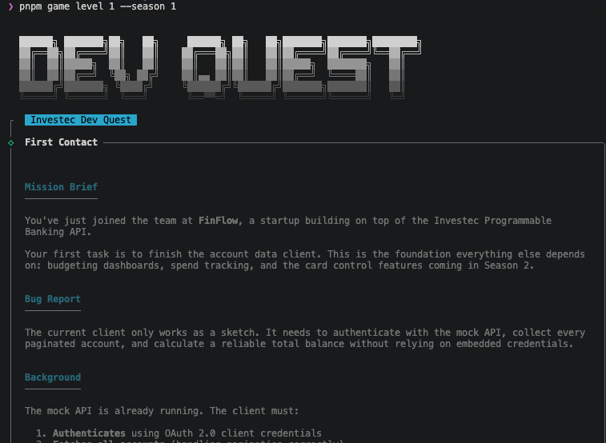
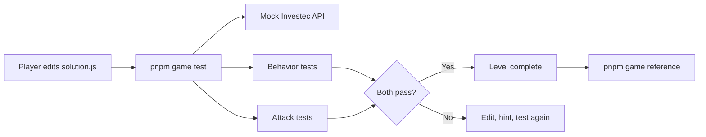
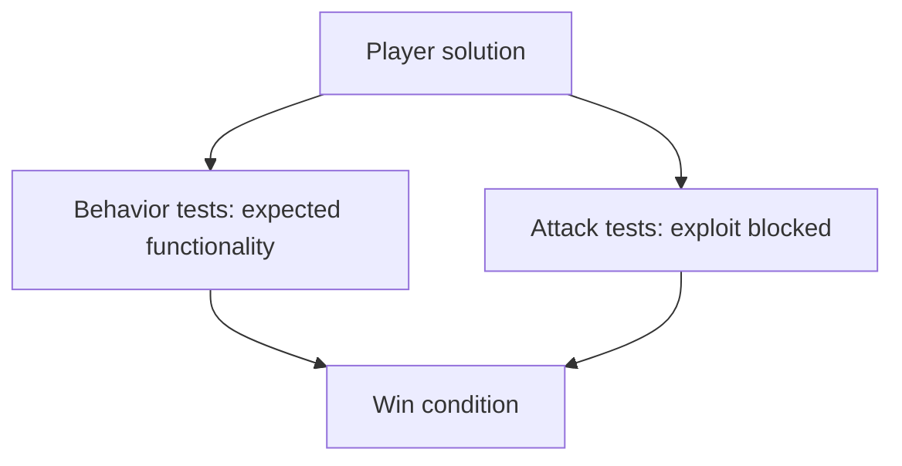
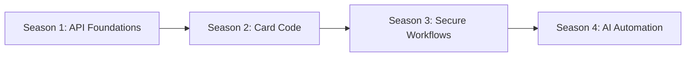

## ⚠️ Playground Project

This is **not an official Investec product**.

It's a community experiment --- a playground to test a fun, API game idea for developers in the [Investec Developer community](https://investec.gitbook.io/programmable-banking-community-wiki).

If you'd like to improve it, simplify it, or make it more ridiculous (in
a good way):

PRs welcome.

------------------------------------------------------------------------

# 🛡️ Investec Developer Quest

A **local-first, level-based developer game** for the Investec developer community.

Learn real-world Investec API patterns, Programmable Banking card logic, and secure fintech engineering — by solving problems in code, not reading slides.

Current content: **19 playable levels** across Seasons 1–4.



---

## Quickstart

```bash
git clone https://github.com/Investec-Developer-Community/investec-dev-quest.git
cd investec-dev-quest
pnpm install
cp .env.example .env
pnpm game level 1 --season 1
```

Windows players: read [Windows Setup](docs/windows-setup.md) before first run (PowerShell execution policy can block pnpm/npm scripts).

Then to test your solution:

```bash
pnpm game test
```

Your editable file for this first level is:

```text
seasons/season-1/level-1/solution.js
```

---

## First Run (Beginner Path)

If you are on Windows, complete [Windows Setup](docs/windows-setup.md) first.

1. Load level: run `pnpm game level 1 --season 1` to read the story and copy starter code.
2. Run test: execute `pnpm game test` to see the first failing checks.
3. Make one small edit in `seasons/season-1/level-1/solution.js`.
4. Re-run `pnpm game test`, or use `pnpm game watch` for automatic feedback while editing.
5. Use hint: if stuck, run `pnpm game hint` to reveal guidance.
6. If failures are confusing, run `pnpm game explain` for non-spoiler coaching and `pnpm game journal` to see recorded choices/consequences.
7. After completion, run `pnpm game reference` to compare with the reference solution and read any debrief.
8. Check status: run `pnpm game status` to track your progress.

Behavior tests prove the feature works. Attack tests prove the vulnerability is blocked. A level is only complete when both pass.

---


## Player Paths

**Note:** The paths below are just suggested learning orders for different interests or workshop tracks. To claim swag, you must complete *all 19 levels* (see the claim instructions below).

Pick a path based on the session you want to run.

| Path | Recommended levels | Best for |
|---|---|---|
| Beginner path | Season 1 Level 1, then Season 2 Level 1 | New players learning the edit-test-hint loop |
| API foundations path | Season 1 Levels 1-6 | OAuth2, pagination, token refresh, beneficiaries, idempotent payments |
| Card code path | Season 2 Levels 1-6 | Programmable Banking `beforeTransaction` rules, MCCs, budgets, velocity limits |
| Security path | Season 2 Level 1, Season 3 Level 1, Season 4 Level 1 | Defensive validation, HMAC verification, exact allowlists |
| AI automation path | Season 4 Levels 1-6 | Tool boundaries, human approval gates, citation integrity, prompt-injection defenses, tool supply-chain safety, loop controls |

Peeps new to the API should start with the beginner path and use hints early. Senior peeps can skip straight to the security or AI automation path and treat each level as a code-review and threat-modeling exercise.

---

## CLI Commands

```bash
pnpm game level <n>               # Load a level (copies starter code, prints story)
pnpm game level <n> --season 2    # Load from a specific season (default: 1)

pnpm game test                     # Run tests + attack script on active level
pnpm game test --season 2 --level 1
pnpm game test --verbose           # Show full Vitest failure traces

pnpm game watch                    # Re-run test + attack on file changes
pnpm game watch --season 2 --level 3 --debounce 300
pnpm game watch --verbose          # Watch mode with full failure traces

pnpm game hint                     # Reveal next hint
pnpm game hint --all               # Show all unlocked hints

pnpm game reference                # Show reference code for a completed level
pnpm game reference --season 2 --level 1 --no-debrief

pnpm game reset                    # Restore starter code (with confirmation)
pnpm game reset --yes              # Skip confirmation

pnpm game status                   # Show progress across all levels
pnpm game journal                  # Show recorded arc choices, evidence trail, and consequences
pnpm game journal --all-evidence   # Show full evidence history
pnpm game explain                  # Convert failing tests into non-spoiler next-step coaching
```

The CLI header now auto-reflects your current mission count and CLI version from the repo state.

Your progress is saved to `~/.investec-game/progress.json`. To reset all progress and start fresh, delete that file:

```bash
rm ~/.investec-game/progress.json
```

## Finished The Quest? Claim Your Prize


**Swag eligibility:** You must complete *all 19 levels* to claim swag, regardless of which path you followed. Partial completion (even if you finish a path) does not qualify.

To reduce spam and bot submissions, the claim form link is not posted publicly in this repo.

Claim flow:
1. Run `pnpm game status` and confirm it shows `19/19 levels complete`.
2. Open a GitHub issue using the **Swag claim request** template.
3. Include your `pnpm game status` screenshot in the issue.
4. A maintainer will share the claim form link with you directly.

We still run this on a community honor system and review claims in good faith.

## How it works

### Level structure

Each level lives in `seasons/season-N/level-N/` and contains:

| File | Purpose |
|---|---|
| `story.md` | The scenario — read this first |
| `starter/solution.js` | Starter template (copied into `solution.js` on first load) |
| `solution.js` | Your working solution — **you edit this** |
| `tests/behavior.test.js` | Behavior tests — must pass |
| `attack/exploit.test.js` | Attack script — must pass after your fix |
| `hints/hint-1.md` | First hint (revealed on demand) |
| `hints/hint-2.md` | Second hint |
| `reference/solution.js` | Reference solution (revealed after completion) |
| `debrief.md` | Optional post-solve explanation shown by `pnpm game reference` |

### Win condition

A level is complete when **both** test suites pass:

1. **Behavior tests** — your implementation handles all the right cases
2. **Attack script** — the vulnerability is fixed (the exploit is blocked)

The attack script is written so that it **passes** when the exploit is blocked. This is the dual-validation mechanic: you can't over-restrict (breaks behavior tests) and can't under-fix (attack script still fails).

### Carry-forward consequences model

The game now tracks objective implementation quality signals and carries them forward into later reference/debrief context.

How it works:
1. Behavior/attack tests emit explicit rubric signal IDs.
2. The CLI maps those signals into deterministic arc flags.
3. Later levels surface consequence summaries (postmortem, visibility, beneficiary chain, operational risk) without changing level pass/fail contracts.

Current consequence lenses:
- Arc Postmortem: broad remediation consequences from unlocked flags.
- Incident Visibility: derived from `s1_logging_maturity`.
- Beneficiary Incident Chain: derived from `s1_beneficiary_risk` with boss-level wrap-up context.
- Operational Risk Summary: derived from `s1_token_fix_depth` + `s2_state_discipline`.

If a consequence section is missing, see troubleshooting guidance in [docs/troubleshooting.md](docs/troubleshooting.md).

When test output still feels ambiguous, use `explain` for a guided next step:

```bash
pnpm game explain
```

Example output:

```text
What likely failed
• Behavior: missing ownership check before exposing account data.
• Attack path still succeeds with a forged accountId.

Suggested next step
• Add a server-side account ownership guard before returning balances.
• Re-run `pnpm game test` to confirm behavior + attack both pass.
```

### Flow diagram



### Dual-validation diagram



---

## Seasons

| Season | Theme |
|---|---|
| 1 | API Foundations — OAuth2, accounts, transactions, pagination |
| 2 | Card Code & Rules Engine — `beforeTransaction`, MCC filters, velocity limits |
| 3 | Secure Fintech Workflows — Webhook signatures, replay protection, secrets |
| 4 | Intelligent Banking Automation — Agent tool boundaries, approval gates, citation integrity |



---

## Mock API

The game includes a mock Investec API that simulates:

- `POST /identity/v2/oauth2/token` — OAuth2 client credentials (`Authorization: Basic`, `x-api-key`, `grant_type=client_credentials`)
- `GET /za/pb/v1/accounts` — Paginated accounts list
- `GET /za/pb/v1/accounts/:id/balance` — Account balance
- `GET /za/pb/v1/accounts/:id/transactions` — Transaction history
- `GET /za/pb/v1/accounts/:id/pending-transactions` — Pending transactions
- `GET /za/pb/v1/accounts/beneficiaries` — Beneficiaries list
- `POST /za/pb/v1/accounts/:id/paymultiple` — Payments with idempotency support

The CLI auto-starts it when a level requires it. No Docker needed.

Base URL: `http://localhost:3001`  
Credentials (from `.env`): `game_client_id` / `game_client_secret` + `game_api_key`

---

## Contributing a level

See [docs/authoring-guide.md](docs/authoring-guide.md) for the full guide.

Quick checklist:
1. Copy `templates/level-template/` into the right season folder
2. Write a realistic scenario in `story.md`
3. Implement a buggy/incomplete `starter/solution.js`
4. Write behavior tests and an attack script
5. Verify the starter fails and your reference solution passes both suites
6. Open a PR

---

## Project structure

```
investec-developer-game/
├── packages/
│   ├── cli/          # investec-game CLI
│   ├── mock-api/     # Mock Investec API (Hono)
│   ├── webhook-emitter/ # Signed webhook sender utilities for Season 3
│   └── shared/       # Shared types and Zod schemas
├── seasons/
│   ├── season-1/     # API Foundations
│   ├── season-2/     # Card Code & Rules Engine
│   ├── season-3/     # Secure Fintech Workflows
│   └── season-4/     # Intelligent Banking Automation
├── templates/
│   └── level-template/
└── docs/
    └── authoring-guide.md
```

## Inspired By

Inspired by GitHub's [Secure Code Game](https://securitylab.github.com/secure-code-game/).
