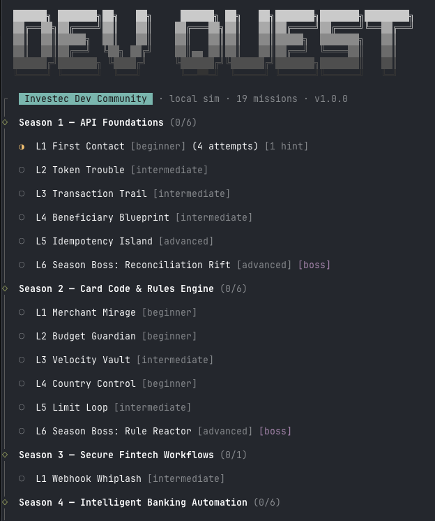

## ⚠️ Playground Project

This is **not an official Investec product**.

This repo is a community playground for learning Investec API and secure fintech engineering by solving code challenges.

# 🛡️ Investec Developer Quest

A local-first, level-based developer game for the Investec developer community.

Learn real-world Investec API patterns, Programmable Banking card logic, and secure engineering by fixing bugs and breaking exploits in code.

Current content: **19 playable levels** across Seasons 1 to 4.



## 🚀 Start Here (5 minutes)

### 🧰 1) Prerequisites

- Node.js 20+
- pnpm 9+

Quick check:

```bash
node -v
pnpm -v
```

Windows players should read [Windows Setup](docs/windows-setup.md) first (PowerShell policy can block scripts).

### 📦 2) Install and start the Quickstart Path

```bash
git clone https://github.com/Investec-Developer-Community/investec-dev-quest.git
cd investec-dev-quest
pnpm install
cp .env.example .env
pnpm game map
pnpm game level 1 --season 1
```

The Quickstart Path is the recommended first route:

1. Season 1 Level 1: `First Contact`
2. Season 2 Level 1: `Merchant Mirage`
3. Season 4 Level 1: `Tool Gatekeeper`

To claim swag, you still need the Grandmaster Run: **all 19 levels**.

### 🧪 3) Run once, then edit once

```bash
pnpm game test
```

Edit this file:

```text
seasons/season-1/level-1/solution.js
```

### 🔁 4) Tight feedback loop

```bash
pnpm game test
# or
pnpm game watch
```

- Stuck? Use `pnpm game hint`
- Failures unclear? Use `pnpm game explain`
- Journal becomes useful after choices/evidence are recorded: `pnpm game journal`

### ✅ 5) Confirm you are on track

```bash
pnpm game status
```

Behavior tests prove the feature works. Attack tests prove the exploit is blocked. A level is complete only when both pass.

## 🧭 Player Paths

These are suggested learning tracks. To claim swag, you must complete **all 19 levels**.

| Path | Recommended levels | Best for |
|---|---|---|
| Quickstart path | Season 1 Level 1, Season 2 Level 1, Season 4 Level 1 | First-time players learning the edit-test-hint loop |
| API foundations path | Season 1 Levels 1-6 | OAuth2, pagination, token refresh, beneficiaries, idempotent payments |
| Card code path | Season 2 Levels 1-6 | `beforeTransaction` rules, MCCs, budgets, velocity limits |
| Security path | Season 2 Level 1, Season 3 Level 1, Season 4 Levels 1, 4, 5 | Validation, HMAC verification, exact allowlists, injection defense |
| Grandmaster Run | All 19 levels | Swag eligibility |

Run `pnpm game map` to see path progress and the next incomplete mission.

## ⌨️ Commands

### Most-used commands

```bash
pnpm game level 1 --season 1
pnpm game test
pnpm game watch
pnpm game hint
pnpm game explain
pnpm game status
pnpm game map
```

### Full command reference

```bash
pnpm game level <n>               # Load a level (copies starter code, prints story)
pnpm game level <n> --season 2    # Load from a specific season (default: 1)
pnpm game level <n> --full        # Show full mission narrative (default is compact brief)

pnpm game test                     # Run tests + attack script on active level
pnpm game test --season 2 --level 1
pnpm game test --verbose           # Show full Vitest failure traces

pnpm game watch                    # Re-run test + attack on file changes
pnpm game watch --season 2 --level 3 --debounce 300
pnpm game watch --verbose          # Watch mode with full failure traces

pnpm game hint                     # Reveal next hint
pnpm game hint --all               # Show all unlocked hints
pnpm game hint --topic auth        # Focus hints using level tags + current failure signals

pnpm game reference                # Show reference code for a completed level
pnpm game reference --season 2 --level 1 --no-debrief

pnpm game reset                    # Restore starter code (with confirmation)
pnpm game reset --yes              # Skip confirmation

pnpm game status                   # Show progress across all levels
pnpm game map                      # Show recommended quest paths and next missions
pnpm game certificate              # Print completion certificate after all 19 levels
pnpm game journal                  # Show recorded arc choices, evidence trail, and consequences
pnpm game journal --all-evidence   # Show full evidence history
pnpm game explain                  # Convert failing tests into non-spoiler next-step coaching
```

The CLI header auto-reflects mission count and CLI version from current repo state.

Progress is stored at `~/.investec-game/progress.json`.

Reset all progress:

```bash
rm ~/.investec-game/progress.json
```

## 🧠 How the Game Works

### Level structure

Each level lives in `seasons/season-N/level-N/`.

| File | Purpose |
|---|---|
| `story.md` | Scenario and context |
| `starter/solution.js` | Starter template copied to working file |
| `solution.js` | Your working solution |
| `tests/behavior.test.js` | Behavior checks |
| `attack/exploit.test.js` | Exploit checks |
| `hints/hint-1.md` | First hint |
| `hints/hint-2.md` | Second hint |
| `reference/solution.js` | Reference implementation after completion |
| `debrief.md` | Required post-solve explanation |

### 🏁 Win condition

Both suites must pass:

1. Behavior tests
2. Attack script

This enforces dual validation: no over-restricting and no under-fixing.

### 📓 Carry-forward consequences

Implementation quality can carry forward into later narrative/debrief context.

Flow:

1. Tests emit explicit rubric signal IDs.
2. CLI maps signals to deterministic arc flags.
3. Later levels surface consequence summaries without changing pass/fail contracts.

Current lenses:

- Arc Postmortem
- Incident Visibility (`s1_logging_maturity`)
- Beneficiary Incident Chain (`s1_beneficiary_risk`)
- Operational Risk Summary (`s1_token_fix_depth` + `s2_state_discipline`)

If a consequence section is missing, see [docs/troubleshooting.md](docs/troubleshooting.md).

## 📚 Seasons

| Season | Theme |
|---|---|
| 1 | API Foundations: OAuth2, accounts, transactions, pagination |
| 2 | Card Code and Rules Engine |
| 3 | Secure Fintech Workflows |
| 4 | Intelligent Banking Automation |

## 🔌 Mock API

Included endpoints:

- `POST /identity/v2/oauth2/token`
- `GET /za/pb/v1/accounts`
- `GET /za/pb/v1/accounts/:id/balance`
- `GET /za/pb/v1/accounts/:id/transactions`
- `GET /za/pb/v1/accounts/:id/pending-transactions`
- `GET /za/pb/v1/accounts/beneficiaries`
- `POST /za/pb/v1/accounts/:id/paymultiple`

The CLI auto-starts mock API for levels that require it.

Base URL: `http://localhost:3001`

Credentials from `.env`: `game_client_id`, `game_client_secret`, `game_api_key`

## 🎁 Claim Your Prize

Swag eligibility requires **19/19 levels complete**.

Claim flow:

1. Run `pnpm game status` and confirm `19/19 levels complete`.
2. Run `pnpm game certificate`.
3. Open a GitHub issue using the Swag claim request template.
4. Include your `pnpm game status` screenshot and certificate text.
5. A maintainer shares the claim form link directly.

## 🤝 Contributing a Level

See [docs/authoring-guide.md](docs/authoring-guide.md).

Quick checklist:

1. Copy `templates/level-template/` into the target season folder.
2. Write scenario in `story.md`.
3. Implement buggy/incomplete `starter/solution.js`.
4. Add behavior tests and attack script.
5. Add two hints and a `debrief.md`.
6. Add `attackName` to `manifest.json`.
7. Verify starter fails and reference passes.
8. Open a PR.

For full validation parity (including API-required levels), run:

```bash
node scripts/validate-levels.mjs --strict
```

## 🗂️ Project Structure

```text
investec-developer-game/
├── packages/
│   ├── cli/
│   ├── mock-api/
│   ├── webhook-emitter/
│   └── shared/
├── seasons/
│   ├── season-1/
│   ├── season-2/
│   ├── season-3/
│   └── season-4/
├── templates/
│   └── level-template/
└── docs/
    └── authoring-guide.md
```

## 🙌 Inspired by

Inspired by GitHub Secure Code Game:
https://securitylab.github.com/secure-code-game/
